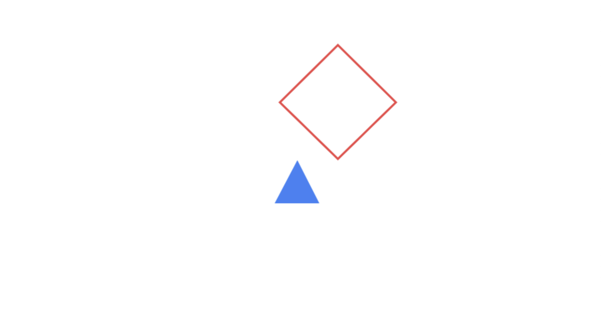
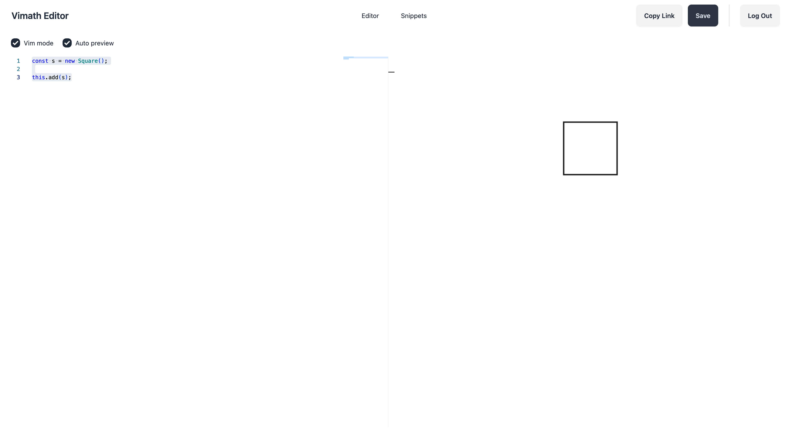

# Vimath (VIsual MATH)

Vimath is a browser library for creating animatable and interactive visualizations. While it's general and flexible enough for any visualizations
it's been built with math education and math visualizations in mind. Vimath is heavily inspired by the work Grant Sanderson (3Blue1Brown) has been doing with the the manim Python library.

## Documentation
https://bryan.blog/vimath/

## Getting started

### Installing

```npm install vimath --save```

### Example usage

```ts
import { Scene, Square } from 'vimath';

class TestScene extends Scene {
    compose() {
        const s = new Square({ lineColor: Colors.red() })
            .shift([1, 2])         // Shift 1 unit right and 2 units up
            .rotate(Math.PI / 4);  // Rotate 45 degrees

        const t = new Triangle({ color: Colors.blue() })
            .scale(0.5);   // Scale down by 50%

        this.add(s, t);

        return this;
    }
}

new TestScene().compose().render();
```

#### Output


## Playground

I created a [little playground](https://vimath-editor.bryan.blog) where you can write/modify Vimath snippets and see the updates in real time. The playground also allows you to save your snippets so they can be embedded into web pages, Notion, Jupyter Notebooks, etc:

> Vimath Playground: https://vimath-editor.bryan.blog

